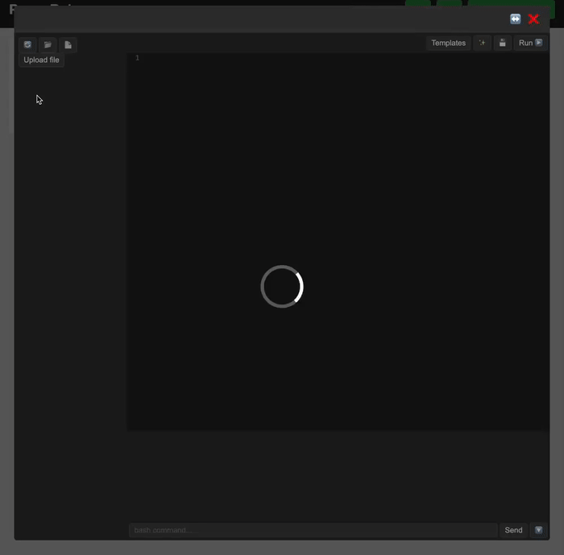

# PequeRoku

PequeRoku is a lightweight platform to **run and share disposable development environments** in the browser.
It combines **QEMU-based virtual machines**, a **FastAPI control service**, a **Django web backend**, and a **browser-based IDE** with Monaco Editor and Xterm.js.

Think of it as a “mini Heroku + VS Code + Playground”, self-hosted and hackable. 🚀

## 💡 Motivation
This project was created to give community members a slice of my servers where they can experiment, learn, and innovate in an isolated environment.


## ✨ Features

* 🔒 **Secure virtual machines** (QEMU/KVM) managed via FastAPI and Redis.
* 🖥️ **Web IDE** with:

  * Monaco Editor (syntax highlighting, themes).
  * Integrated terminal (xterm.js).
  * File tree, upload/download, templates.
* 📊 **Metrics dashboard** (Chart.js) for CPU, memory, threads.
* 🤖 **AI-assisted scaffolding**: generate code templates from natural language prompts.
* 📂 **Repository cloning** from GitHub.
* 🐳 **Containerized stack** with Docker Compose.
* 🧩 **Pluggable architecture** (Redis state store, Django/DRF APIs, FastAPI VM manager).


## 🛠️ Technology Stack

* **Virtualization**: QEMU, KVM (with ARM/x86 support).
* **Backend (VM Service)**: FastAPI + Paramiko + psutil.
* **Backend (Web Service)**: Django + Django Rest Framework + Channels.
* **State**: Redis.
* **Database**: PostgreSQL.
* **Frontend**: Vanilla JS, Monaco Editor, Xterm.js, Chart.js, CSS themes.
* **Orchestration**: Docker Compose, Nginx.


## 📦 Installation

### Prerequisites

* Linux host (Ubuntu/Debian recommended).
* Docker & Docker Compose installed.
* At least one prepared **base qcow2 image**.

### 1. Prepare base qcow2 image

Follow the [qcow2 creation steps](create-image.md) if you don't already have a qcow2 image.

Move your image into source/vm_data/base/ (relative to the repository root).
```bash
mv debian12-golden.qcow2 ./source/vm_data/base/
```

### 2. Clone the repository

```bash
git clone https://github.com/HectorPulido/pequeroku.git
cd pequeroku
```

### 3. Configure environment

* Per service, copy the env template to `.env` and adjust values:
  * `source/web_service/.env.template` → `source/web_service/.env` (DB credentials, allowed hosts, auth, etc.)
  * `source/vm_service/.env.template` → `source/vm_service/.env` (AUTH_TOKEN, Redis, base image overrides, etc.)
* Ensure your SSH key mapping in `source/docker-compose.yaml` under `vm_services` matches your host key path.

### 4. Start services

```bash
cd source
docker compose up --build
```


The stack includes:

* VM manager (FastAPI).
* Web service (Django + DRF).
* Redis + Postgres.
* Nginx (serves frontend + static files; routes `/` to dashboard, `/ide/` to IDE, `/metrics/` to metrics).


## 🚀 Usage


1. Open the web UI at [http://localhost](http://localhost).
2. Log in with your user. If you don't have one, create an admin in the web container:
   ```bash
   cd source
   docker compose exec web python manage.py createsuperuser
   ```
3. Create a container (VM).
4. Open it in the IDE (or navigate directly to `/ide/` for the IDE, `/metrics/` for metrics):
   * Edit code with Monaco.
   * Run commands in the terminal.
   * Upload/download files.
   * Clone from GitHub.
5. Open **Metrics dashboard** to monitor CPU, memory, threads.
6. Optionally, use the **AI Generator** to scaffold new projects.


## 🤖 AI Features

PequeRoku can generate complete projects from scratch using OpenAI‑compatible services. More ways to use the AI coming soon...




## 🤝 Contributing

We 💖 contributions!

1. Fork the repo 🍴
2. Create feature branch: `git checkout -b feature/awesome` 🌟
3. Commit your changes: `git commit -m "Add awesome feature"` ✏️
4. Push: `git push origin feature/awesome` 📤
5. Open a Pull Request 🚀


## License

This project is distributed under the MIT License. See the `LICENSE` file for details.

<div align="center">
<h3 align="center">Let's connect 😋</h3>
</div>
<p align="center">
<a href="https://www.linkedin.com/in/hector-pulido-17547369/" target="blank">
</a> &nbsp; &nbsp;
<a href="https://twitter.com/Hector_Pulido_" target="blank">
</a> &nbsp; &nbsp;
<a href="https://www.twitch.tv/hector_pulido_" target="blank">
</a> &nbsp; &nbsp;
<a href="https://www.youtube.com/channel/UCS_iMeH0P0nsIDPvBaJckOw" target="blank">
</a> &nbsp; &nbsp;
<a href="https://pequesoft.net/" target="blank">
</a> &nbsp; &nbsp;
