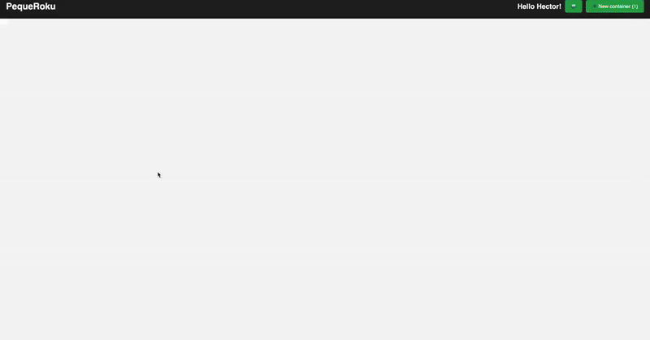

# PequeRoku

Welcome to **PequeRoku**, your 🎯 go-to MicroVM management platform! Built with Django, QEMU, Docker, Redis, and Nginx, PequeRoku puts the power of containers at your fingertips with a fun and simple SPA frontend. 




## 📚 Table of Contents

1. [💡 Motivation](#-motivation)
2. [💾 TODO](#-todo)
3. [✨ Features](#-features)
4. [🚀 Services](#-services)
5. [🔧 Prerequisites](#-prerequisites)
6. [⚡ Getting Started](#-getting-started)
7. [🎮 Usage](#-usage)
8. [📂 Project Structure](#-project-structure)
9. [🤝 Contributing](#-contributing)
10. [📜 License](#license)


## 💡 Motivation
This project was created to give community members a slice of my servers where they can experiment, learn, and innovate in an isolated environment.


## ✨ Features

* 🐳 **Container Management**: Instantly start, stop, and restart QEMU VM with a click! 
* 💻 **Interactive Shell**: Type commands and see real-time logs—just like magic! (AND 100% COMPATIBLE WITH CLOUDFLARE TUNNELS)
* 🎉 **Live coding enviroment**: You can access your files, upload, edit and run without the console
* 👥 **User management** Powered by django there is a powerfull user management admin
* 🛡️ **Resource Quotas**: Keep things fair by limiting CPU, memory, and container counts per user. 
* 📁 **File Upload**: Drag & drop files directly into your running containers. 
* 🔗 **RESTful API**: Automate everything programmatically! 
* 🖥️ **SPA Frontend**: Fast, snappy single-page app written in vanilla JavaScript. 
* 🌐 **Reverse Proxy**: Nginx for static assets + API proxying—rock-solid performance! 


## 💾 Todo
* Guides and Tips
* Multiples instances
* More container management


## 🚀 Services

Configured in `docker-compose.yaml`:

* **web**: Django + Gunicorn 🌟
* **db**: PostgreSQL 16 🗄️ (persistent volume)
* **nginx**: Nginx latest 🌐 (serves SPA + proxies API)

All on network: `pequeroku-net` 🔗


## 🔧 Prerequisites

Before you start, make sure you have:

* 🐳 Docker & Docker Compose
* 🐍 Python 3.13+
* ✒️ GNU Make (optional)
* 📄 A `.env` file with necessary environment variables


## ⚡ Getting Started

### 📥 Clone the Repository

```bash
git clone https://github.com/yourusername/pequeroku.git
cd pequeroku
```

### Create qcow2
# Ubuntu/Debian

1. Install dependencies
```bash
sudo apt-get update
sudo apt-get install -y qemu-kvm qemu-utils cloud-image-utils genisoimage \
                        libvirt-daemon-system libvirt-clients libvirt opcional
```

2. Download the base image
```bash
sudo mkdir -p /opt/qemu/base /opt/qemu/vms
cd /opt/qemu/base
# This for ubuntu
sudo curl -LO https://cloud-images.ubuntu.com/jammy/current/jammy-server-cloudimg-amd64.img
sudo qemu-img convert -O qcow2 jammy-server-cloudimg-amd64.img jammy-base.qcow2

# Then flatten the image
qemu-img info /opt/qemu/base/jammy-base.qcow2
if backing file: /opt/qemu/base/jammy-base.qcow2... let's flatten

qemu-img convert -O qcow2 /opt/qemu/base/jammy-base.qcow2 /opt/qemu/base/jammy-base-flat.qcow2
mv /opt/qemu/base/jammy-base.qcow2 /opt/qemu/base/jammy-base.qcow2.bak
mv /opt/qemu/base/jammy-base-flat.qcow2 /opt/qemu/base/jammy-base.qcow2

qemu-img info /opt/qemu/base/jammy-base.qcow2 | grep -i backing || echo "Done flattening ✅"
```

3. Edit the docker-compose.yaml
Add the ssh_authorized_keys on the docker-compose.yaml
Adjust also the packages, activate the kvm, etc.


### 🔑 Environment Variables

Create a `.env` file in the root folder:

```env
SECRET_KEY=<your-django-secret-key>
DB_NAME=mydb
DB_USER=myuser
DB_PASSWORD=mypassword
DB_HOST=db
DB_PORT=5432
DEBUG=1  # 0 for production
```

### 🏗️ Build and Run

```bash
docker-compose build
docker-compose up -d
```

* 🔍 Visit `http://localhost` to explore PequeRoku!
* 🔐 Admin: `http://localhost/admin/`


## 🎮 Usage

### 🌐 Web Interface

1. 🔑 **Login** with your Django account.
2. 📊 **Dashboard** shows your container usage & quotas.
3. ➕ **Create Container** to spin up a fresh Ubuntu shell.
4. 🖥️ **Console** opens a live terminal—run commands & see logs.
5. 📤 **File Upload** to push files into your container.

### 📡 API Endpoints

| 🔧 Method | 📍 Path                                   | 📖 Description                        |
| -------- | ------- | -------- |
| POST      | `/api/login/`                             | User login                            |
| POST      | `/api/logout/`                            | User logout                           |
| GET       | `/api/user_data/`                         | Fetch user info & quotas              |
| GET       | `/api/containers/`                        | List your containers                  |
| POST      | `/api/containers/`                        | Launch a new container                |
| DELETE    | `/api/containers/{id}/`                   | Stop & remove container               |
| POST      | `/api/containers/{id}/send_command/`      | Send shell command                    |
| GET       | `/api/containers/{id}/read_logs/`         | Get container logs                    |
| POST      | `/api/containers/{id}/restart_container/` | Restart shell session (not container) |
| POST      | `/api/containers/{id}/upload_file/`       | Upload file inside container          |

> All API calls require CSRF & session auth—stay secure! 🔒


## 📂 Project Structure

```
.
├── docker-compose.yaml
├── Dockerfile
├── entrypoint.sh
├── front/             # SPA assets (HTML, CSS, JS)
│   ├── index.html
│   ├── styles.css
│   └── app.js
├── nginx/             # Nginx config
│   └── default.conf
├── pequeroku/         # Django project core
│   ├── settings.py
│   ├── urls.py
│   ├── wsgi.py
│   └── asgi.py
└── docker_manager/    # Container management app
    ├── models.py
    ├── views.py
    ├── serializers.py
    ├── session.py
    ├── urls.py
    └── admin.py
```


## 🤝 Contributing

We 💖 contributions!

1. Fork the repo 🍴
2. Create feature branch: `git checkout -b feature/awesome` 🌟
3. Commit your changes: `git commit -m "Add awesome feature"` ✏️
4. Push: `git push origin feature/awesome` 📤
5. Open a Pull Request 🚀


## License

This project is distributed under the MIT License. See the `LICENSE` file for details.

<div align="center">
<h3 align="center">Let's connect 😋</h3>
</div>
<p align="center">
<a href="https://www.linkedin.com/in/hector-pulido-17547369/" target="blank">
</a> &nbsp; &nbsp;
<a href="https://twitter.com/Hector_Pulido_" target="blank">
</a> &nbsp; &nbsp;
<a href="https://www.twitch.tv/hector_pulido_" target="blank">
</a> &nbsp; &nbsp;
<a href="https://www.youtube.com/channel/UCS_iMeH0P0nsIDPvBaJckOw" target="blank">
</a> &nbsp; &nbsp;
<a href="https://pequesoft.net/" target="blank">
</a> &nbsp; &nbsp;
