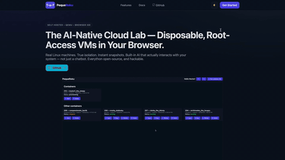
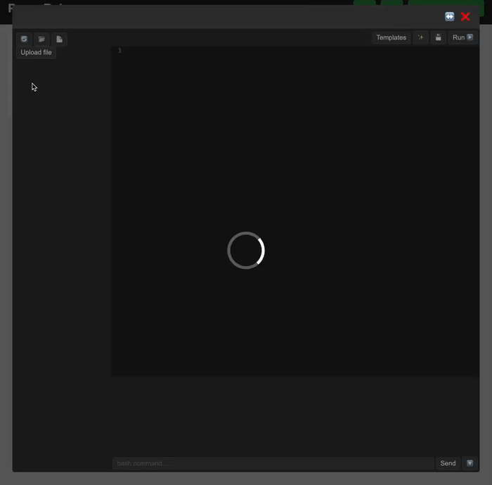

# PequeRoku

> Your own always-on, self-hosted cloud lab: real, root-access VMs in the browser, with an AI agent that operates the machine.

<p align="center">
  <a href="https://github.com/HectorPulido/pequeroku/blob/main/LICENSE"></a>
  <a href="https://github.com/HectorPulido/pequeroku/stargazers"></a>
  <a href="https://github.com/HectorPulido/pequeroku/issues"></a>
  <a href="https://github.com/HectorPulido/pequeroku/pulls"></a>
  
</p>


## Demo

<p align="center">
  <br>
  <em>Open a real Linux VM from any device: laptop, tablet, or phone. No setup, no waiting.</em>
</p>


## What Is It?

PequeRoku is an open-source, self-hosted alternative to Replit, Codespaces, and Gitpod. Instead of a locked-down container, you get a real virtual machine (QEMU/KVM) with full root, a browser IDE, and a built-in [AI agent](./AI.md) that reads your code, runs commands, brings services up, and fixes things inside the box.

It is always on, with no cold starts, no sandbox, and no per-seat billing. The only limits are the ones your own hardware sets.

```
git clone  →  ./start.sh  →  http://localhost/dashboard/  →  start coding
```


## The Problem

Every developer knows the ritual:

| | |
|---|---|
| **Time wasted** | 25 to 50 minutes lost on every environment switch, days lost onboarding |
| **Dependency hell** | version conflicts, missing packages, mismatched OS versions |
| **Context switching** | cloning repos and rebuilding state for every project |
| **"Works on my machine"** | environments that drift the moment you look away |

Cloud IDEs promised a fix. In practice they are limited, vendor-locked, and their cost scales with your team. You should not have to choose between power and convenience.


## Why PequeRoku Is Different

* **Real root on a real VM.** Install Docker, run `systemd`, build a kernel. It is a Linux machine, not a sandbox.
* **Always on.** Your workspace is ready when you are, with no boot and no cold start.
* **An agent with real tools.** [Pequenin](#meet-pequenin-the-ai-that-operates-your-vm) edits files, runs your tests, starts servers, and verifies them live inside the VM. See the internals in [AI.md](./AI.md).
* **Reachable from anywhere.** The IDE is responsive, so you can work from a laptop, tablet, or phone.
* **Open source and hackable.** It runs on your own infrastructure under the MIT license, and every layer is extensible.
* **Affordable to self-host.** It is built to run on modest hardware, including a homelab.

> I built PequeRoku because I could not find a remote dev platform that was open, root-accessible, always-on, reachable from anywhere, and affordable to run myself. So I made one.


## Meet Pequenin, the AI That Operates Your VM

<p align="center">
  <br>
  <em>Pequenin does not just suggest. It edits, runs, and verifies inside your VM.</em>
</p>

Pequenin is an agentic coding agent that operates your environment. It lives in the IDE chat and works through real tools. The full breakdown lives in [AI.md](./AI.md):

* **Reads, writes, and edits files** with whitespace-tolerant, surgical edits.
* **Searches your code** with glob and grep, directly on the VM.
* **Runs shell commands**, both foreground and long-running background jobs it can monitor.
* **Brings services up** and checks that they respond.
* **Searches the web and fetches URLs** when it needs documentation.
* **Spawns subagents** to explore in parallel, and keeps multiple switchable conversations per VM.
* **OpenAI-compatible**, so you bring your own provider: Groq for speed, OpenAI for quality, or HuggingFace for flexibility.

The result is not a snippet to copy. Pequenin creates the files, installs the dependencies, starts the server, and confirms it responds. For the agent loop, tools, and event protocol, read [AI.md](./AI.md).


## Features

| Capability | Description |
|---|---|
| **Real VMs** | QEMU/KVM with strong per-developer isolation |
| **Browser IDE** | Monaco editor and Xterm.js terminal, fully responsive |
| **Agentic AI** | Pequenin operates the VM: files, shell, services, and web ([AI.md](./AI.md)) |
| **Live preview** | Built-in mini-browser proxies your app straight from the VM |
| **Persistent and always-on** | Your workspace survives, with no cold starts |
| **Disposable workspaces** | Reset to a clean slate while keeping your config |
| **Full root** | Install anything, with no guardrails in the way |
| **Quotas and roles** | Per-user resource limits for team deployments |
| **Public API & MCP** | Drive everything from scripts, the [Python SDK](./sdk/), or an MCP agent ([`/api/v1`](#public-api--mcp-server) + MCP server) |


## How It Works

Three services and your VM work together:

```
Browser            React IDE (Monaco + Xterm.js)
   |
   |  HTTPS / WebSocket
   v
web_service        Django, DRF, Channels
   |               auth, quotas, templates, Pequenin (the AI brain)
   |  HTTP
   v
vm_service         FastAPI
   |               VM lifecycle (QEMU), SSH pool, live terminal
   |  SSH / SFTP
   v
Your VM            Debian, full root, /app workspace
```

The brain (the AI and agentic loop, detailed in [AI.md](./AI.md)) runs in `web_service`. The hands (files, exec, terminal) are SSH operations that `vm_service` executes inside the VM. The front end only ever talks to `web_service`.

**Stack:** Django · DRF · Channels · FastAPI · QEMU/KVM · React · Monaco · Xterm.js · Postgres · Redis · Docker

Full architecture and setup: [Wiki](https://github.com/HectorPulido/pequeroku/wiki). Deep dive on the AI engine: [AI.md](./AI.md).


## Public API & MCP server

The same substrate that powers the IDE is exposed as a versioned, public API —
*infra as API*. Anything the dashboard does, a script, the SDK, or an AI agent
can do too, authenticated with an API key. There are no privileged side paths:
the SDK and the MCP server are just clients of `/api/v1`.

```
client (script / SDK / CLI / MCP agent)
   │  Authorization: Bearer pk_<prefix>_<secret>
   ▼
web_service  /api/v1/   (API keys, quotas, stable contract)   ── + MCP server at /mcp
   ▼
vm_service   /vms/...    (QEMU VMs, isolated network)
```

### Get a key + the MCP string

In the dashboard, click **API & MCP** in the header (route `/dashboard/keys`).
It's a self-serve page to create, list, and revoke API keys, and it shows your
MCP connection string and a ready-to-paste `claude mcp add` command. The secret
is shown **once** — only its hash is stored.

Operators can also mint keys from the CLI:

```bash
docker compose exec web python manage.py create_api_key <username> --scopes read,exec,admin
```

Keys carry scopes — `read` < `exec` < `admin` — so you decide how much power each
script or agent gets (`read` can't run code; `exec` can't create/destroy).

### REST API (`/api/v1`)

The spec **is** the documentation: OpenAPI at `/api/v1/schema/`, Swagger UI at
`/api/v1/schema/swagger-ui/`. Errors use a stable envelope
`{"error": {"code", "message"}}` with enumerated codes (`quota_exceeded`,
`machine_not_running`, `forbidden_scope`, `timeout`, …).

| Method & path | Does |
|---|---|
| `POST /api/v1/containers` | Create a container (`{type, name?, ttl_seconds?}`) |
| `GET /api/v1/containers` | List your containers |
| `POST /api/v1/containers/{id}/exec` | Run a command → `{stdout, stderr, exit_code}` (or `background` → `process_id`) |
| `PUT /api/v1/containers/{id}/files` | Batch-write files |
| `GET /api/v1/containers/{id}/ports` | Listening ports + preview paths |
| `POST /api/v1/runs` | **One-shot**: create + run + destroy, sync or `async` |
| `GET /api/v1/runs/{id}` | Poll an async run |
| `GET /api/v1/types` | Flavors available to you + credit cost |

One-shot run in a throwaway VM:

```bash
curl -X POST http://localhost/api/v1/runs \
  -H "Authorization: Bearer pk_xxx" -H "Content-Type: application/json" \
  -d '{"command":"python main.py","files":[{"path":"main.py","content":"print(\"hi\")"}]}'
# → {"status":"succeeded","stdout":"hi\n","exit_code":0, ...}
```

### Python SDK

```python
from pequeroku import PequeRoku                # sdk/
pq = PequeRoku(api_key="pk_xxx", base_url="http://localhost")
print(pq.run("echo hello").stdout)             # one-shot
c = pq.create_container(type="small", name="blog")
pq.exec(c["id"], "python -m http.server 8000", background=True)
```

See [`sdk/README.md`](./sdk/README.md).

### MCP server

PequeRoku ships an [MCP](https://modelcontextprotocol.io) server so any
MCP-capable agent (Claude Code, Claude Desktop, …) gets **hands** on a real
sandbox — create VMs, run code, move files, inspect ports — over streamable HTTP
at `/mcp`. Connect it with the key from the dashboard's **API & MCP** page:

```bash
claude mcp add --transport http pequeroku http://localhost/mcp \
  --header "Authorization: Bearer pk_xxx"
```

It exposes 9 task-shaped tools (`run_code`, `list_containers`,
`get_or_create_container`, `container_exec`, `process_status`, `write_files`,
`read_path`, `get_preview`, `destroy_container`). The blast radius of anything an
agent runs is **one isolated VM**, not your machine — that's the pitch: give your
agent a real sandbox with sane defaults (destroy needs confirmation, runs carry a
timeout + TTL).

> The MCP server is **platform-only by design**: it never exposes Pequenin or any
> agent internals. The MCP client already *is* the agent; PequeRoku provides the
> hands, not the brain. See the boundary in [AI.md](./AI.md). Details:
> [`source/mcp_service/README.md`](./source/mcp_service/README.md).


## Quick Start

```bash
git clone https://github.com/HectorPulido/pequeroku.git
cd pequeroku/source
./start.sh
```

`start.sh` is idempotent — re-run it anytime. It bootstraps your local config
(creates the `.env` files with random secrets, and on Linux hosts with `/dev/kvm`
turns on KVM for fast VMs) and then runs `docker compose up`. Prefer two steps?
`./setup.sh && docker compose up` does the same thing; `setup.sh` only ever
creates missing files, it never overwrites — so it's always safe to re-run.

1. Open `http://localhost/dashboard/`.
2. Log in and create your first VM.
3. Start coding, or ask Pequenin to scaffold the project for you.

**Faster VM boots (optional).** On first run, if no base image exists,
`vm_service` auto-downloads a Debian cloud image and boots VMs through cloud-init
(~50s to SSH). Build a pre-baked "golden" image to cut that to ~10s — it writes a
self-describing `*.meta.json` sidecar that `vm_service` detects, so no env edits
are needed:

```bash
./vm_service/scripts/build-golden.sh --force   # --force replaces the auto-downloaded base
docker compose restart vm_services
```

`vm_service` generates its own SSH keypair in the persistent `vm_data` volume, so
VMs work with zero key setup. To bring your own key instead, set `VM_SSH_KEY` to an
absolute path in `source/.env` and uncomment the key mounts in `docker-compose.yaml`.

> [!IMPORTANT]
> **Upgrading a checkout that predates `start.sh`?** The compose file no longer
> hard-mounts a host SSH key. Your existing base image keeps working untouched —
> an image with no `*.meta.json` is auto-detected as a golden (cloud-init stays
> off), so there's nothing to backfill. But that golden baked a specific public
> key, so keep using the matching private key, or vm_service generates a new one
> and existing VMs/goldens become unreachable. Drop your key into the persistent
> volume (no compose edits needed):
>
> ```bash
> mkdir -p source/vm_data/keys
> cp ~/.ssh/id_ed25519     source/vm_data/keys/id_vm_pequeroku
> cp ~/.ssh/id_ed25519.pub source/vm_data/keys/id_vm_pequeroku.pub
> chmod 600 source/vm_data/keys/id_vm_pequeroku
> ```
>
> Or set `VM_SSH_KEY` to the key's absolute path in `source/.env` and uncomment the
> key mounts in `docker-compose.yaml`.

> Detailed walkthrough: [Wiki, Getting Started](https://github.com/HectorPulido/pequeroku/wiki/Getting-Started).

That gives you a self-hosted, Replit-style workspace under your control.


## How It Compares

| | **PequeRoku** | Replit / Codespaces / Gitpod |
|---|:---:|:---:|
| Hosting | Self-hosted, your hardware | Their cloud |
| Compute | Real VM (QEMU/KVM) | Containers |
| Root access | Full root | Limited |
| Cold starts | None, always-on | Boot and wait |
| AI | Agent that operates the box | Mostly autocomplete or chat |
| Source | Open source (MIT) | Proprietary |
| Cost | Your hardware | Per-seat or usage |


## Roadmap

* Fast snapshots and one-click rollback
* Richer multi-user roles and guardrails
* Automations: a push triggers tests in the active VM
* Better UI for managing multiple instances
* gRPC internal transport and a standalone AI microservice (see the roadmap in [AI.md](./AI.md))
* More Pequenin capabilities


## Contribute

PequeRoku is open to ideas, bug reports, and pull requests.

* Browse the [Issues](https://github.com/HectorPulido/pequeroku/issues).
* Share feedback, ideas, or problems. I reply to everything.
* Deploy it in your homelab and tell me how it went.


## Support the Project

If PequeRoku resonates with you:

* Star the repo. It helps others discover it.
* Spread the word.
* Run it in your homelab and share your setup.

> PequeRoku is not the ultimate platform. It is your platform, a small way to take back control.


## Links

* [pequeroku.net](https://pequeroku.net)
* [GitHub Wiki](https://github.com/HectorPulido/pequeroku/wiki)
* [Medium Article](https://medium.com/p/19bc757c735d)
* License: MIT. See the [LICENSE](./LICENSE) file for details.


<div align="center">
<h3 align="center">Let's connect</h3>
</div>
<p align="center">
<a href="https://www.linkedin.com/in/hector-pulido-17547369/" target="blank">
</a> &nbsp; &nbsp;
<a href="https://twitter.com/Hector_Pulido_" target="blank">
</a> &nbsp; &nbsp;
<a href="https://www.twitch.tv/hector_pulido_" target="blank">
</a> &nbsp; &nbsp;
<a href="https://www.youtube.com/channel/UCS_iMeH0P0nsIDPvBaJckOw" target="blank">
</a> &nbsp; &nbsp;
<a href="https://pequesoft.net/" target="blank">
</a> &nbsp; &nbsp;
</p>
